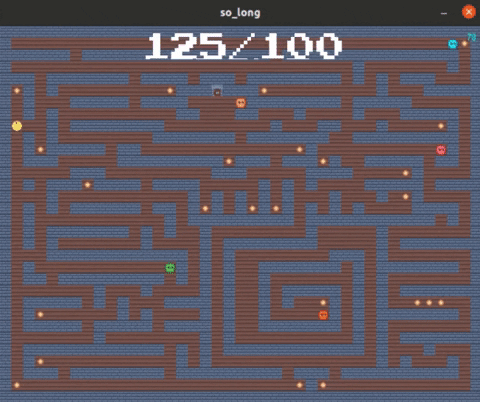

# Projet So_long

So_long is an individual school project at 42 Paris campus. This project is a small 2D game with minilibx. You'll learn about textures, sprites and tiles.

  

## Installation

### Run without bonus

``make all
``

``./so_long /maps/map.ber
``

### Run with bonus

``make bonus
``

``./so_long /maps/bonus_map.ber
``

## Game Commands

* WASD to move
* ESC to quit

## BONUS

* Animated sprite
* Display the number of steps on the screen
* Enemy patrol

#### This project works only under a Linux OS, to make it work under a MACOS please install the associated Minilibx.